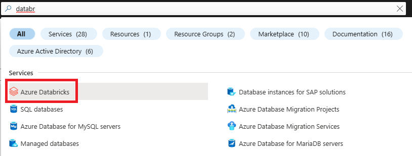
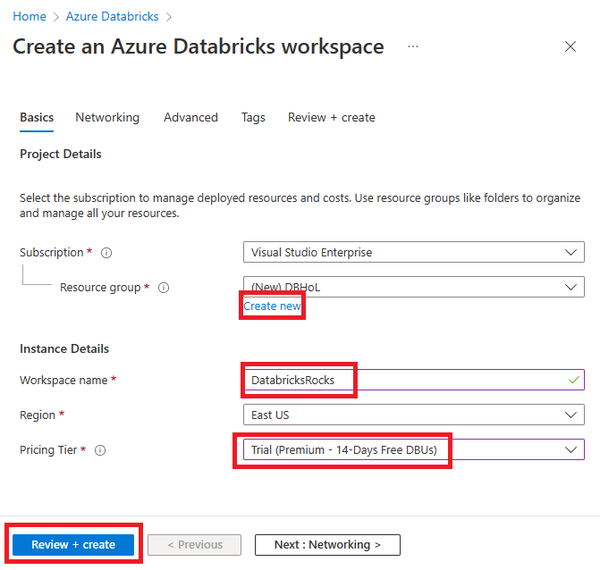

# Module 00 - Lab Environment Setup

**[Home](../README.md)** - [Next Module >](../Modules/module01.md)

## :loudspeaker: Introduction

In order to follow along with the Azure Databricks lab exercises, you need to provision a set of resources.

## :thinking: Prerequisites

* An [Azure account](https://azure.microsoft.com/free/) with an active subscription.
* Owner permissions within a Resource Group to create resources and manage role assignments.

    
## :test_tube: Lab Environment Setup

1. Open [Azure Portal](https://portal.azure.com) and in the search bar look up Databricks. Select Azure Databricks
    

2. Select Create
3. Under resource group select, **Create new**. Create a unique workspace name for your databricks instance. Pick a regions closest to you. Select **Trial** Pricing Tier. Then select **Review + Create**.
    

## :tada: Summary

By successfully deploying the Azure Databricks, you are ready to follow along with the learning exercises.

A resource group will be deployed for you to add upcoming resources to. There will be another resource group created that is specific for the databricks resources.

[Continue >](../Modules/module01.md)
