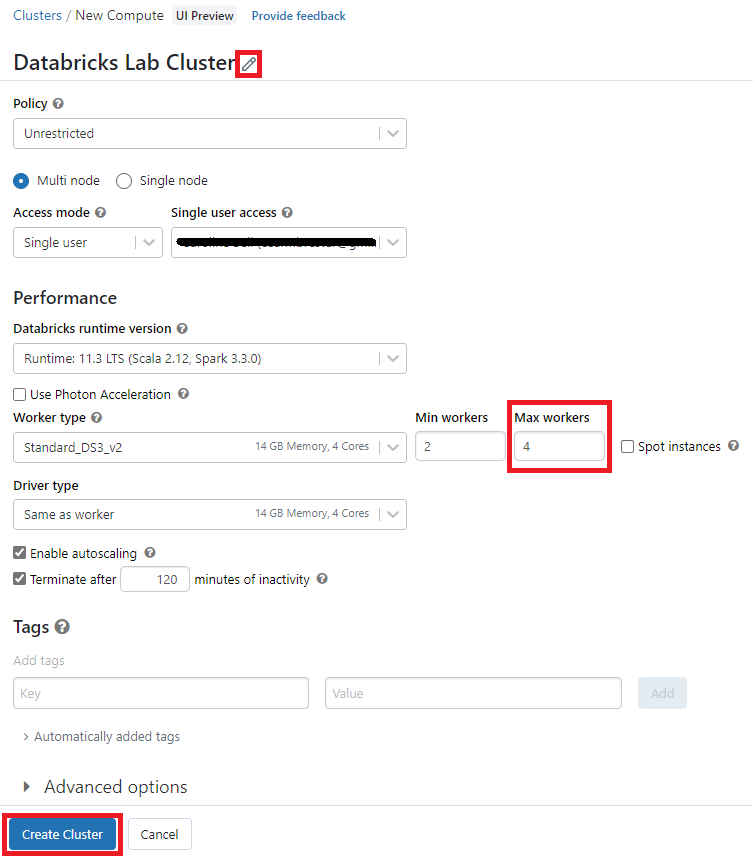

# Module 01 - Create a Cluster

[< Previous Module](../Modules/module00.md) - **[Home](../README.md)** - [Next Module >](../Modules/module02.md)

## 1. Open Databricks

1. Navigate to your Azure Databricks account and click the **Launch Workshpace** tile.

    

2. A signin page will appear and load your credentials in from Azure
   
   
   
3. A popup will prompt a selection of project type. In this lab, we will choose Exploring data (Python, R).

    

## 2. Create a Cluster

1. On the left hand side, you will select **Create a cluster**.

    
    
2. Under **All-purpose compute**, you will select **Create compute**. A cluster is a set of computation resources and configurations on which you run data engineering, data science, and data analytics workloads.

    
    
    A new screen will appear, where you will outline the policy. To update the name of your cluster, you will need to select the pencil icon next to the cluster name. You will need to updates the inputs for creation:

| Parameter | Value |
| --- | --- |
| Cluster Name | Databricks Lab Cluster |
| Max workers | 4 |

It will take a few minutes to create the cluster. Once it does, there will be a green check mark next to the name of the cluster.

[Continue >](../modules/module02.md)
    
