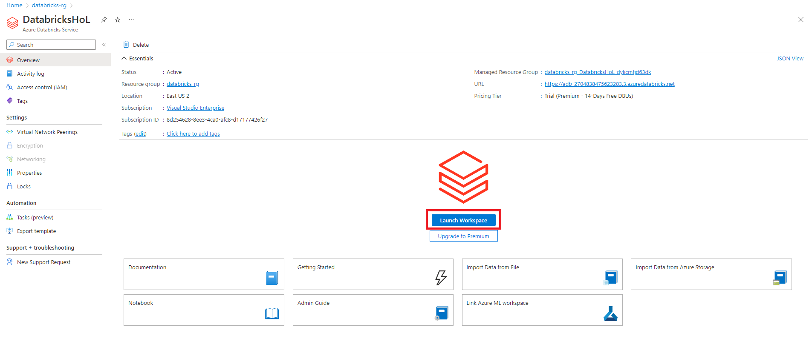
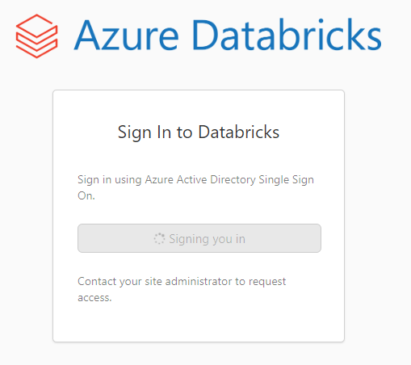
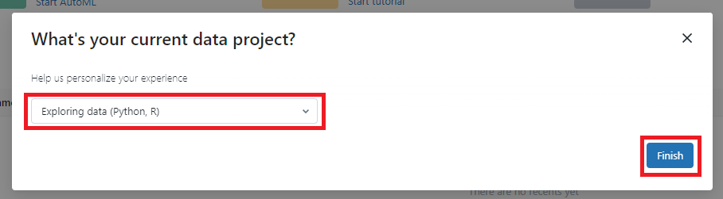
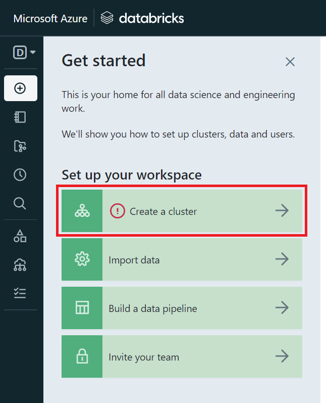
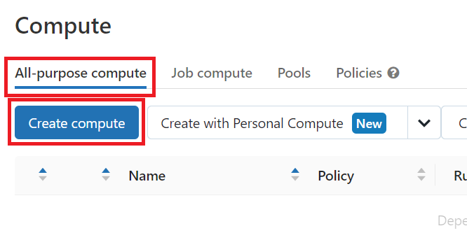
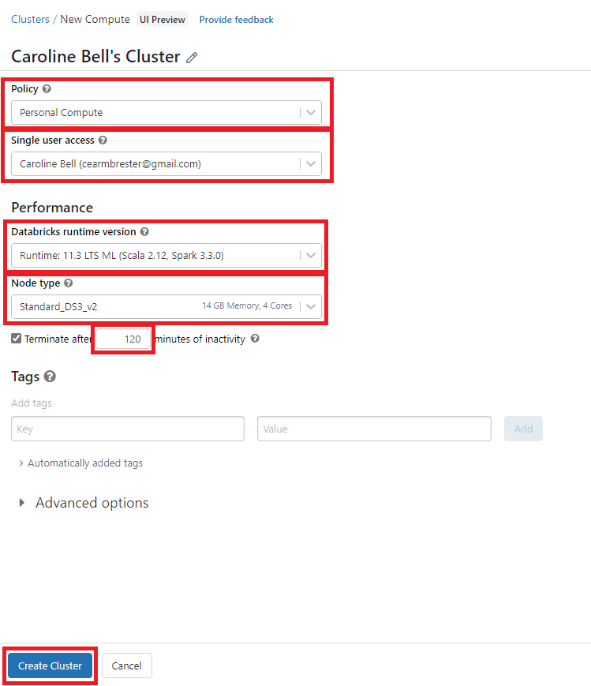

# Module 01 - Create a Cluster

[< Previous Module](../Modules/module00.md) - **[Home](../README.md)** - [Next Module >](../Modules/module02.md)

## 1. Open Databricks

1. Navigate to your Azure Databricks account and click the **Launch Workshpace** tile.

    

2. A signin page will appear and load your credentials in from Azure
   
   
   
3. A popup will prompt a selection of project type. In this lab, we will choose Exploring data (Python, R).

    

## 2. Create a Cluster

1. On the left hand side, you will select **Create a cluster**.

    
    
2. Under **All-purpose compute**, you will select **Create compute**. A cluster is a set of computation resources and configurations on which you run data engineering, data science, and data analytics workloads.

    
    
    A new screen will appear, where you will outline the policy. You will need to provide the inputs for creation:

| Parameter | Value |
| --- | --- |
| Policy | Personal Compute |
| Databricks runtime version | Runtime: 11.3 LTS ML (Scala 2.12, Spark 3.3.0) |
| Node Type | Standard_DS3_v2 |
| Terminate after | 120 minutes |

    
