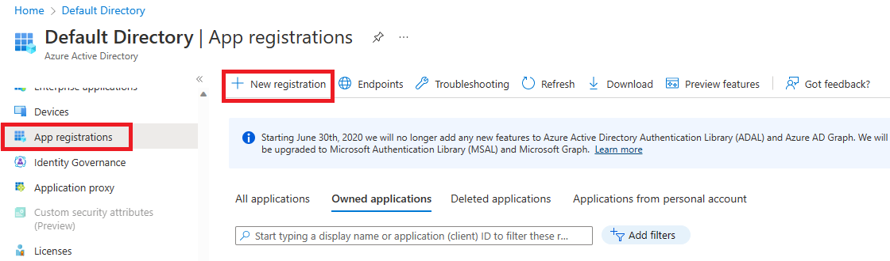
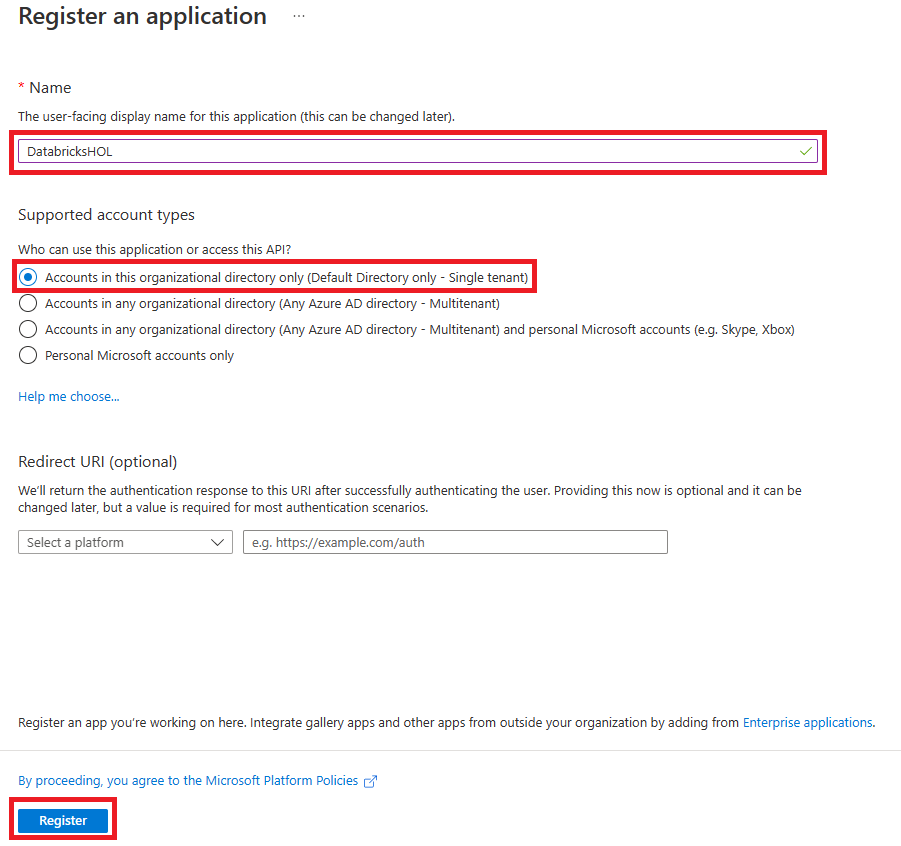
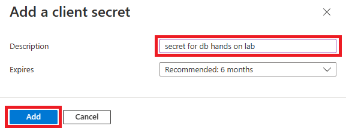
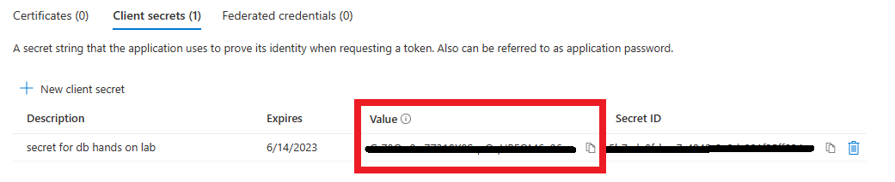
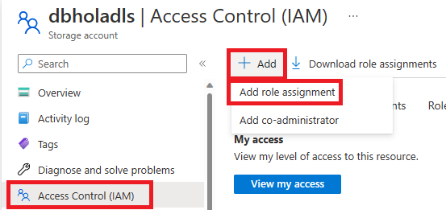
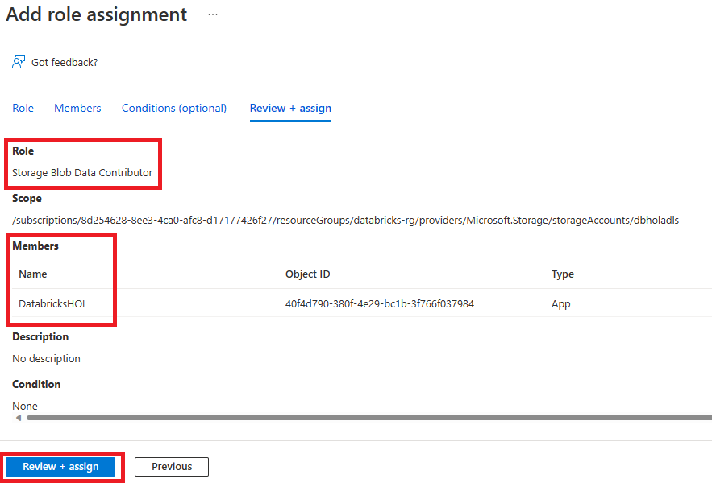
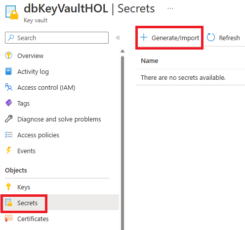
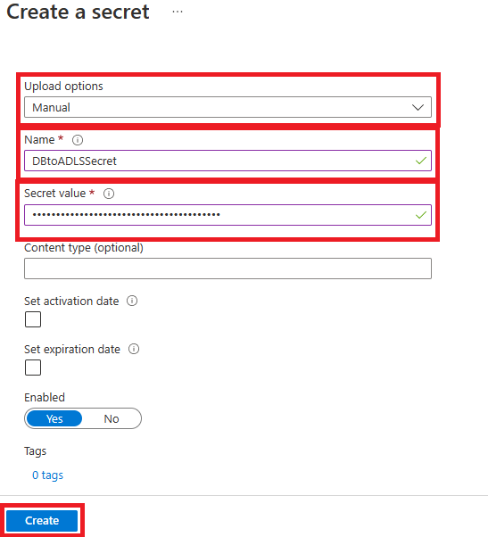
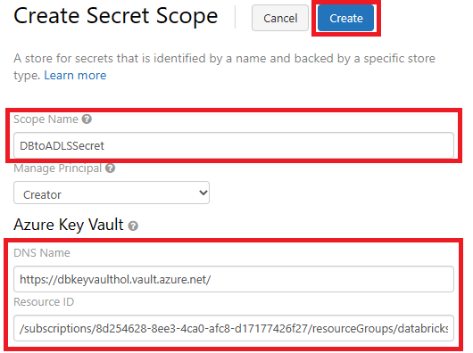

# Module 02 - Set up Azure Data Lake Storage Gen 2 and Azure Key Vault

[< Previous Module](../Modules/module01.md) - **[Home](../README.md)** - [Next Module >](../Modules/module03.md)

## 1. Create a Azure Data Lake Storage account
1. Sign in to the [Azure portal](https://portal.azure.com), navigate to the **Home** screen, click **Create a resource**.

2. Search the Marketplace for "Storage Accounts" and click **Create**.

  

3. Provide the necessary inputs on the **Basics** tab and click **Next: Advanced >**.  

| Parameter | Value |
| --- | --- |
| Resource Group | databricks-rg |
| Storage account name | dbholadls |
| Performance | Premium |
| Premium account type | Block blobs |

  
  
4. On the **Advance** tab, under Data Lake Storage Gen 2 select **Enable hierarchial namespace**, and click **Review**.

  
  
5. Once Validation is complete, click **Create**.

## 2. Assign Storage Blob Data Contributor Role
1. Sign in to the [Azure portal](https://portal.azure.com), navigate to your databricks resource group (e.g. databricks-rg).

2. Naviage to **Access control (IAM)** and select **Add role assignment**.

  
  
3.In the search bar, look for **Storage Blob Data Contributor** role, then click Next.

4. Under the Members tab, click **+ Select Members** and add your username. Then click **Review + Assign**

  
  
## 3. Download AzCopy
1. Go to the [AzCopy Doc page](https://learn.microsoft.com/en-us/azure/storage/common/storage-use-azcopy-v10?toc=%2Fazure%2Fstorage%2Fblobs%2Ftoc.json) and download the appropriate version for your computer.
    > Note: If you already have AzCopy downloaded, make sure it is version 10.

## 4. Create a client secret
1. Sign in to the [Azure portal](https://portal.azure.com), navigate to your Azure Active Directory account.

2. Under manage, select App Registration. Then Click **+ New Registration **
  

3. When registering an application, create a unique name for the App registration. Select **Accounts in this organizational directory only (Default Directory only - Single tenant)** as the **Supported Account Types**.  Then select **Register**.

  

4. Once the app registration is complete, in **Manage** click **Certificates & secrets**.  

5. On the **Client secrets** tab, click **New client secret**.
 
  
  
6.In the **Add a client secret pane**, for **Description**, enter a description for the client secret. For **expires**, keep it at the recommended 6 months. Then click **Add**.

  
  
7. A Client secret will be created, copy the **Value** of the secret. Be sure to save it somewhere you can easily get to, you won't be able to access it again.

  

8. Return to the **Overview** page, in the Essentials section, copy the **Application (client) ID** and **Directory (tenant) ID**.
  
  [Essentials](../Images/Module02/essentials.png)
  
## 5. Add client secret to Key Vault
1. In the Azure portal, go to the [Storage accounts](https://portal.azure.com/#view/HubsExtension/BrowseResource/resourceType/Microsoft.Storage%2FStorageAccounts) service.

2. Select an Azure storage account that was created in **Step 1**.

3. Click Access Control (IAM).

4. Click + Add and select Add role assignment from the dropdown menu.
  
  

6. Set the Role to Storage Blob Data Contributor, then add to the Member field the name of the Service Prinicipal in Step 4, substep 3.

7. Click **Review + assign**.
    
    
 
8. Search for the Azure Key Vault that was automatically created in Module 00.

9. On the key vault settings pages, select Secrets. Click on + Generate/Import.

    
    
10. In Upload options, select Manual. For Name, enter in the name: **DBtoADLSSecret**. The secret name must be unique within a key vault.  For Value, paste the Client Secret that you stored in Step 4, substep 7. Click Create.

    

## 6. Create Azure Key Vault-backed secret scope
1. Go to https://<databricks-instance>#secrets/createScope. This URL is case sensitive; scope in createScope must be uppercase.
  
2. Enter in a scope name. Leave Manage Prinicpal as Creator. The DNS Name is found in the **Overview** tab in the Key Vault page in Azure as Vault URI. The Resource ID is found in the Key Vault's Properties tab.

    
