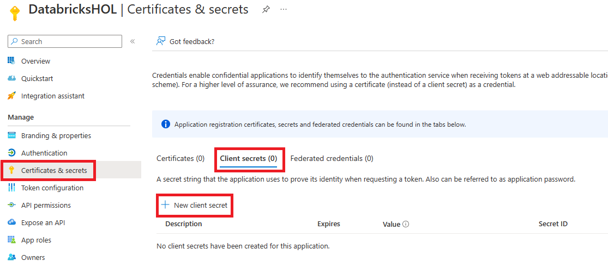

# Module 02 - Set up Azure Data Lake Storage Gen 2

[< Previous Module](../Modules/module01.md) - **[Home](../README.md)** - [Next Module >](../Modules/module03.md)

## 1. Create a Azure Data Lake Storage account
1. Sign in to the [Azure portal](https://portal.azure.com), navigate to the **Home** screen, click **Create a resource**.

2. Search the Marketplace for "Storage Accounts" and click **Create**.

  

3. Provide the necessary inputs on the **Basics** tab and click **Next: Advanced >**.  

| Parameter | Value |
| --- | --- |
| Resource Group | databricks-rg |
| Storage account name | dbholadls |
| Performance | Premium |
| Premium account type | Block blobs |

  
  
4. On the **Advance** tab, under Data Lake Storage Gen 2 select **Enable hierarchial namespace**, and click **Review**.

  
  
5. Once Validation is complete, click **Create**.

## 2. Assign Storage Blob Data Contributor Role
1. Sign in to the [Azure portal](https://portal.azure.com), navigate to your databricks resource group (e.g. databricks-rg).

2. Naviage to **Access control (IAM)** and select **Add role assignment**.

  
  
3.In the search bar, look for **Storage Blob Data Contributor** role, then click Next.

4. Under the Members tab, click **+ Select Members** and add your username. Then click **Review + Assign**

  
  
## 3. Download AzCopy
1. Go to the [AzCopy Doc page](https://learn.microsoft.com/en-us/azure/storage/common/storage-use-azcopy-v10?toc=%2Fazure%2Fstorage%2Fblobs%2Ftoc.json) and download the appropriate version for your computer.
    > Note: If you already have AzCopy downloaded, make sure it is version 10.

## 4. Create a client secret
1. Sign in to the [Azure portal](https://portal.azure.com), navigate to your Azure Active Directory account.

2. Under manage, select App Registration. Then Click **+ New Registration **
  

3. When registering an application, create a unique name for the App registration. Select **Accounts in this organizational directory only (Default Directory only - Single tenant)** as the **Supported Account Types**.  Then select **Register**.
  

4. Once the app registration is complete, in **Manage** click **Certificates & secrets**.  

5. On the **Client secrets** tab, click **New client secret**.
  
