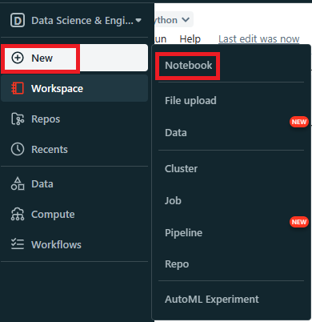
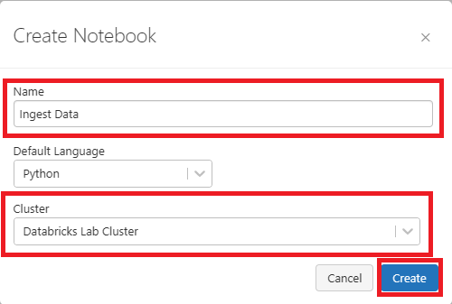
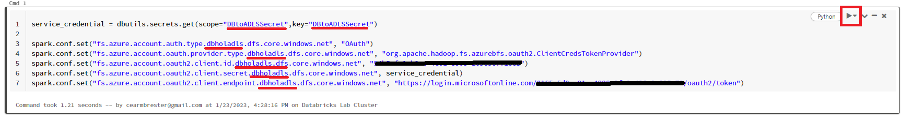
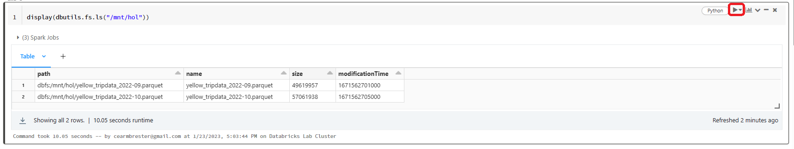

# Module 03 - Import Data

[< Previous Module](../Modules/module02.md) - **[Home](../README.md)** - [Next Module >](../Modules/module04.md)


## 1. Connect Azure Data Lake to Databricks

1. Navigate to your Azure Databricks account and click the **Launch Workshpace** tile.
2. On the left hand navigation, click the + sign. Select **Notebook**.

    

3. A new screen will show up asking for a Name, Default Language, and Cluster for the new notebook. Name the notebook **Ingest Data**, keep the default language to **Python**. Select cluster **Databricks Lab Cluster** that you created in Module 1. Then select **Create**.

    

4. Insert the following code into the first cell.

```
service_credential = dbutils.secrets.get(scope="<scope>",key="<service-credential-key>")

spark.conf.set("fs.azure.account.auth.type.<storage-account>.dfs.core.windows.net", "OAuth")
spark.conf.set("fs.azure.account.oauth.provider.type.<storage-account>.dfs.core.windows.net", "org.apache.hadoop.fs.azurebfs.oauth2.ClientCredsTokenProvider")
spark.conf.set("fs.azure.account.oauth2.client.id.<storage-account>.dfs.core.windows.net", "<application-id>")
spark.conf.set("fs.azure.account.oauth2.client.secret.<storage-account>.dfs.core.windows.net", service_credential)
spark.conf.set("fs.azure.account.oauth2.client.endpoint.<storage-account>.dfs.core.windows.net", "https://login.microsoftonline.com/<directory-id>/oauth2/token")
```

   Replace:

 * **scope** with the secret scope name from Module 02, step 6.
 * **service-credential-key** with the name of the key containing the client secret.
 * **storage-account** with the name of the Azure storage account.
 * **application-id** with the Application (client) ID for the Azure Active Directory application.
 * **directory-id** with the Directory (tenant) ID for the Azure Active Directory application.

5. In the top right corner of the cell, select the play button to run the code. This will mount our Azure Data Lake Gen 2 to Databricks.

    

6. Click the + sign below the cell to create a new blank cell.
7. In our first cell, we established we can connect to our Data Lake. Now we are going to mount our Data Lake to our Databricks notebook. Copy the code below into the new cell.

```
configs = {"fs.azure.account.auth.type": "OAuth",
          "fs.azure.account.oauth.provider.type": "org.apache.hadoop.fs.azurebfs.oauth2.ClientCredsTokenProvider",
          "fs.azure.account.oauth2.client.id": "<application-id>",
          "fs.azure.account.oauth2.client.secret": dbutils.secrets.get(scope="<scope-name>",key="<service-credential-key-name>"),
          "fs.azure.account.oauth2.client.endpoint": "https://login.microsoftonline.com/<directory-id>/oauth2/token"}

# Optionally, you can add <directory-name> to the source URI of your mount point.
dbutils.fs.mount(
  source = "abfss://<container-name>@<storage-account-name>.dfs.core.windows.net/",
  mount_point = "/mnt/<mount-name>",
  extra_configs = configs)
  ```

  Replace

* **application-id** with the Application (client) ID for the Azure Active Directory application.
* **scope-name** with the Databricks secret scope name.
* **service-credential-key-name** with the name of the key containing the client secret.
* **directory-id** with the Directory (tenant) ID for the Azure Active Directory application.
* **container-name** with the name of a container in the ADLS Gen2 storage account.
* **storage-account-name** with the ADLS Gen2 storage account name.
* **mount-name** with the name of the intended mount point in DBFS. **Note** I will be naming my mount **hol**.

Then run the cell by pressing the play button. The output should come back as true.

## 2. Display Data
1. First we want to see what data is in our container. Select the + sign to create a new cell. Copy the code below into the cell. **Note**, I named my mounted storage hol in the previous step.

```
display(dbutils.fs.ls("/mnt/hol"))
```
Then run this code for the following results:
    

We see that there are two parquet files in our container.

2. 