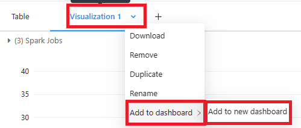

# Module 03 - Import and Visualize Data

[< Previous Module](../Modules/module02.md) - **[Home](../README.md)** - [Next Module >](../Modules/module04.md)


## 1. Connect Azure Data Lake to Databricks

1. Navigate to your Azure Databricks account and click the **Launch Workshpace** tile.
2. On the left hand navigation, click the + sign. Select **Notebook**.

    

3. A new screen will show up asking for a Name, Default Language, and Cluster for the new notebook. Name the notebook **Ingest Data**, keep the default language to **Python**. Select cluster **Databricks Lab Cluster** that you created in Module 1. Then select **Create**.

    

4. Insert the following code into the first cell.

```
service_credential = dbutils.secrets.get(scope="<scope>",key="<service-credential-key>")

spark.conf.set("fs.azure.account.auth.type.<storage-account>.dfs.core.windows.net", "OAuth")
spark.conf.set("fs.azure.account.oauth.provider.type.<storage-account>.dfs.core.windows.net", "org.apache.hadoop.fs.azurebfs.oauth2.ClientCredsTokenProvider")
spark.conf.set("fs.azure.account.oauth2.client.id.<storage-account>.dfs.core.windows.net", "<application-id>")
spark.conf.set("fs.azure.account.oauth2.client.secret.<storage-account>.dfs.core.windows.net", service_credential)
spark.conf.set("fs.azure.account.oauth2.client.endpoint.<storage-account>.dfs.core.windows.net", "https://login.microsoftonline.com/<directory-id>/oauth2/token")
```

   Replace:

 * **scope** with the secret scope name from Module 02, step 6.
 * **service-credential-key** with the name of the key containing the client secret.
 * **storage-account** with the name of the Azure storage account.
 * **application-id** with the Application (client) ID for the Azure Active Directory application.
 * **directory-id** with the Directory (tenant) ID for the Azure Active Directory application.

5. In the top right corner of the cell, select the play button to run the code. This will mount our Azure Data Lake Gen 2 to Databricks.

    

6. Click the + sign below the cell to create a new blank cell.
7. In our first cell, we established we can connect to our Data Lake. Now we are going to mount our Data Lake to our Databricks notebook. Copy the code below into the new cell.

```
configs = {"fs.azure.account.auth.type": "OAuth",
          "fs.azure.account.oauth.provider.type": "org.apache.hadoop.fs.azurebfs.oauth2.ClientCredsTokenProvider",
          "fs.azure.account.oauth2.client.id": "<application-id>",
          "fs.azure.account.oauth2.client.secret": dbutils.secrets.get(scope="<scope-name>",key="<service-credential-key-name>"),
          "fs.azure.account.oauth2.client.endpoint": "https://login.microsoftonline.com/<directory-id>/oauth2/token"}

# Optionally, you can add <directory-name> to the source URI of your mount point.
dbutils.fs.mount(
  source = "abfss://<container-name>@<storage-account-name>.dfs.core.windows.net/",
  mount_point = "/mnt/<mount-name>",
  extra_configs = configs)
  ```

  Replace

* **application-id** with the Application (client) ID for the Azure Active Directory application.
* **scope-name** with the Databricks secret scope name.
* **service-credential-key-name** with the name of the key containing the client secret.
* **directory-id** with the Directory (tenant) ID for the Azure Active Directory application.
* **container-name** with the name of a container in the ADLS Gen2 storage account.
* **storage-account-name** with the ADLS Gen2 storage account name.
* **mount-name** with the name of the intended mount point in DBFS. **Note** I will be naming my mount **hol**.

Then run the cell by pressing the play button. The output should come back as true.

## 2. Display Data
1. First we want to see what data is in our container. Select the + sign to create a new cell. Copy the code below into the cell. **Note**, I named my mounted storage hol in the previous step.

```
display(dbutils.fs.ls("/mnt/hol"))
```
Then run this code for the following results:
    

We see that there are two parquet files in our container.

2. Click the + sign under the cell to create a new cell. Lets investigate the first parquet file. Copy the code below then run the cell.

```
df = spark.read.format("parquet").options(header='true', inferschema='true').load("dbfs:/mnt/hol/yellow_tripdata_2022-09.parquet")
display(df)
```


The result should show you the first 1000 rows of data from the parquet file.


## 3. Visualize Data
1. Click the + sign next to the table icon from the previous query. Select Visualization.

    

2. A visualization editor page will appear. We will be creating a bar chart to show average trip distance by Vendor ID. Select the following options:

    * Visualization Type: Bar
    * X Column: Vendor ID
    * Click Add Columns for Y Column
    * Y Column: Trip_Distance
    * Y column aggregation: Average
    * Group by: Vendor ID
    * Missing and NULL Values: Do not display in chart

Then Click Save.


3. The visualization will appear in the same area as the table display of the data. You can download the aggredated data into CSV, Excel, or TSV.


## 4. Data Profile of Data
1. Click the + sign next to the table icon from the previous query. Select Data Profile.

    
2. It will automatically generate a statistical analysis of each column in the dataset.
    

### 5. Databricks Dashboard
1. Visualizations can be pinned to a dashboard. Select the dropdown next to Visualization and select Add to Dashboard. Select Add to a New Dashboard.
    
    

2. You will enter the dashboard view of your data. You can add other visualizations to this dashboard. Click the pen icon and update the name from Untitled to Ingest Dashboard.

    

3. Return your notebook view. Go to the Data Profile view of your data. 
4. Select the drop down in Data Profile 1 and select Add to Dashboard. Then select our new dashboard Ingest Data to add our visualization to. 

    

5. Select the blue button in a box to pull the Dashboard back up and to see your new visualization added to your dashboard.

   

## 6. SQL Statements in Databricks
1. You can embed SQL code within Python to query the data. We are going to create a temporary SQL view of our Taxi Cab data. We want to see all the rides done by Vendor 1. Copy the code below into a new cell, then run the cell.

```
# Create a temporary sql view for querying data
df.createOrReplaceTempView('df')

#using SQL to query data to show only rides from Vendor ID = 1
vendor1 = spark.sql("SELECT * FROM df WHERE VendorID = 1")
display(vendor1)
```


## 7. Change Data Language
### Change Language for Entire Notebook
1. Go to the top right corner of the notebook by the Notebook name and select the python dropdown. Select R.


    

2. A popup will appear indicating you are changing the default language. ```%python``` will appear at the top of your cells written in python. Select confirm.

    

3. If you look at the first cell in our notebook, ```%python``` is now at the top of each cell.

    

The cells now have a default language of R.  You can continue to code in Python by adding the ```%python``` to the top of your cell.

### Change Language for a Cell
1. At the top of the cell, you can specify the language you'd like to use. 

    ```
    %python
    %scala
    %r
    %sql
    ```

2. The cell will indicate what language you are coding in, in the top right hand corner.
    

[Continue >](../Modules/module04.md)
