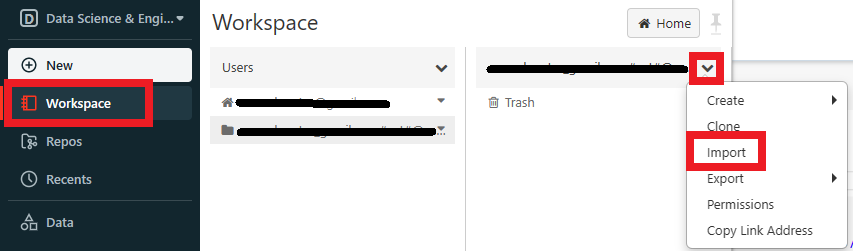
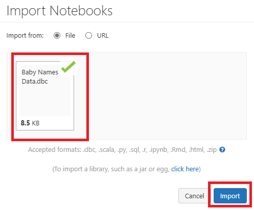
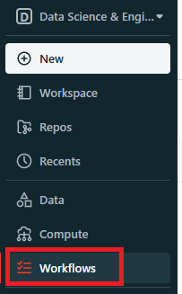
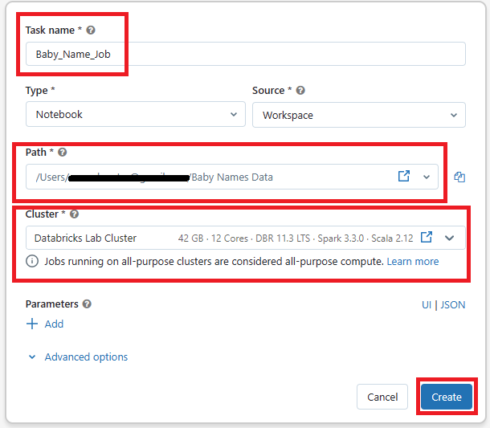

# Module 04 - Workflows

[< Previous Module](../Modules/module03.md) - **[Home](../README.md)** - [Next Module >](../Modules/module05.md)

## 1. Upload Notebook
1. Download the [Baby Names Data notebook](../Notebooks/Baby%20Names%20Data.dbc) from the Notebook folder. 
2. In Databricks go to the Workspace tab and select your user name.

    

3. A screen will appear for you to navigate to the .dbc file you downloaded from step 1. Then select Import.

    

4. The new notebook should appear in your Workspace. 

**OPTIONAL** You can run through the cells in the notebook if you would like, otherwise move onto the next step.

## 2. Create Job
1. Go to the left hand navigation and select Workflow.

    
2. Select Create Job.
3. First you will need to Name your Task. Below are the items you need to input:
    * Task name: Baby_Name_Job
    * Type: Notebook
    * Source: Workspace
    * Path: When you select the path location, go to where you just imported that .dbc file.
    * Cluster: Shared_job_cluster

Then select Create.

4. In the top right corner, Select Run Now.
5. 