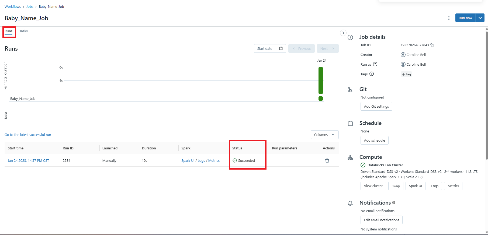
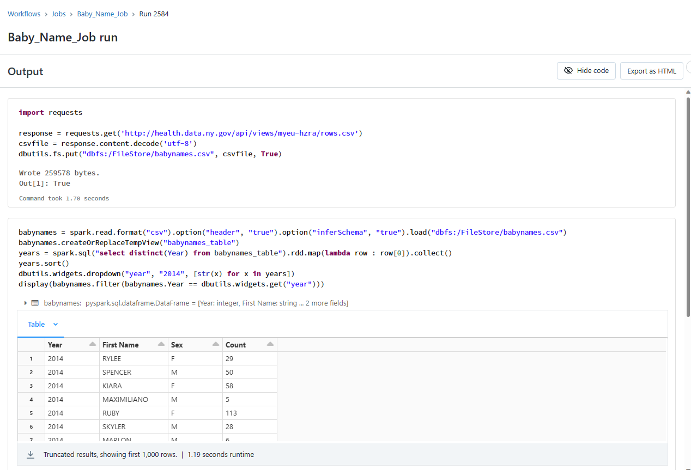
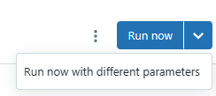
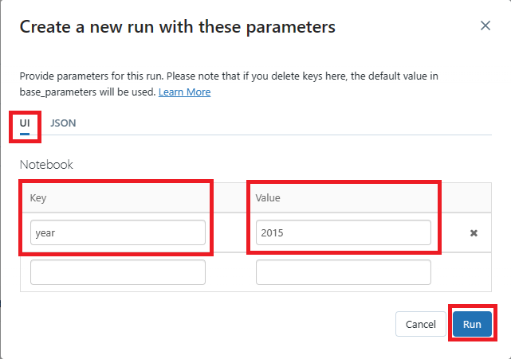
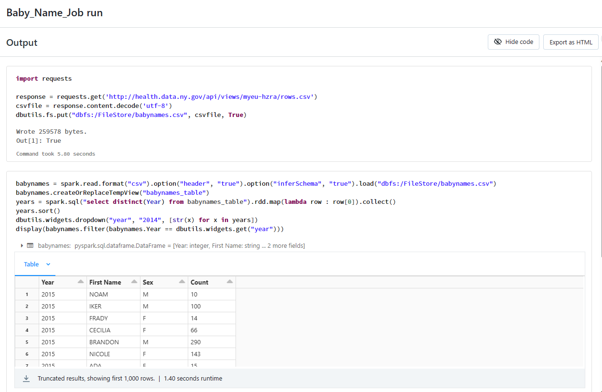

# Module 04 - Workflows

[< Previous Module](../Modules/module03.md) - **[Home](../README.md)** 

## 1. Upload Notebook
1. Download the [Baby Names Data notebook](../Notebooks/Baby%20Names%20Data.dbc) from the Notebook folder. 
2. In Databricks go to the Workspace tab and select your user name.

    

3. A screen will appear for you to navigate to the .dbc file you downloaded from step 1. Then select Import.

    

4. The new notebook should appear in your Workspace. 

**OPTIONAL** You can run through the cells in the notebook if you would like, otherwise move onto the next step.

## 2. Create Job
1. Go to the left hand navigation and select Workflow.

    
2. Select Create Job.
3. First you will need to Name your Task. Below are the items you need to input:
    * Task name: Baby_Name_Job
    * Type: Notebook
    * Source: Workspace
    * Path: When you select the path location, go to where you just imported that .dbc file.
    * Cluster: Databricks Lab Cluster (the cluster we created in Module 01)

Then select Create.

4. In the top right corner, Select Run Now.
5. Toggle to the Run view of the job. It should only take about 10 seconds for a Successful Run to appear.

    

6. Select the successful runs log time to view the output. It will show you the code run in the cells and the output of the queries.

    

**Note** If you ran this code in the notebook, you will have the same output.

## 3. Run with Different Parameters
1. Open the Baby_Name_Run Job and select the dropdown next to Run now. Select Run now with different parameters.

    

2. Under UI, we will add the year 2015 to filter our names on.
    * Key: year
    * Value: 2015

    Then select Run

    

3. After a successful run, open the logs again to see the output. Even though the cell says it is filtering on 2014, the results show 2015 due to the different parameters being passed.

    